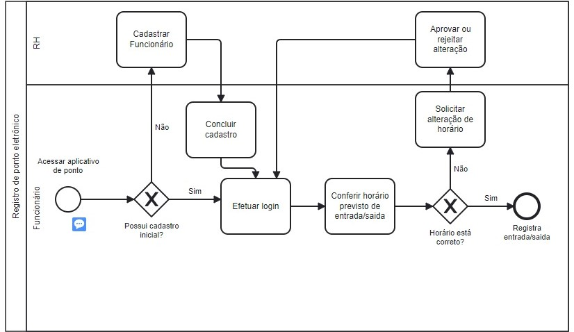

# Especificações do Projeto

Pré-requisitos: <a href="1-Documentação de Contexto.md"> Documentação de Contexto</a>

Definição do problema e ideia de solução a partir da perspectiva do usuário. É composta pela definição do  diagrama de personas, histórias de usuários, requisitos funcionais e não funcionais além das restrições do projeto.

Apresente uma visão geral do que será abordado nesta parte do documento, enumerando as técnicas e/ou ferramentas utilizadas para realizar a especificações do projeto

## Personas

Maria Luiza tem 43 anos, é formada em engenharia química e trabalha em uma indústria do ramo. A empresa em que ela trabalha possui 7.890 funcionários com horários fixos. Todos trabalham seguindo o modelo presencial em horário comercial, com pequenas exceções quando é necessário trabalhar até mais tarde ou finais de semana. Apesar de possuir vários locais onde eles conseguem bater ponto, nos horários de entrada, saída e almoço, eles acabam perdendo muito tempo, pois ficam filas enormes devido a quantidade de funcionários. 

João Pedro tem 20 anos e trabalha no fórum de sua cidade. O fórum tem poucos funcionários e no setor em que João trabalha, são apenas funcionários terceirizados. Todos eles seguem o modelo presencial com horários fixos e não pode ocorrer um atraso de mais de 5 minutos, porque a empresa que os contratou não permite. No fórum existe apenas um local onde eles batem ponto e é com a máquina cartográfica que carimba o papel, depois a empresa confere. As vezes acontece do horário ser carimbado no lugar errado e então ele tem que levar no Departamento Pessoal da empresa para que arrume manualmente os erros. 

Gabriela tem 34 anos e é gerente de uma startup. Na empresa em que ela trabalha, eles adotaram o modelo remoto de trabalho após a pandemia. Antes, eles batiam ponto por biometria dentro da empresa e agora ficou complicado saber se os funcionários estão realmente cumprindo seu horário de serviço e de fazer o cálculo de horas extras de cada funcionário. 

Murilo tem 27 anos e trabalha no setor de Departamento Pessoal de uma empresa de médio porte. O seu time na empresa tem poucos agentes e os funcionários da empresa batem ponto através da máquina cartográfica. Apesar de não ter muitas pessoas que trabalham nesse local, o Murilo tem que conferir manualmente todos os pontos antes do acerto todos os meses. Com isso, ele tem que dedicar muito tempo para poder conferir um a um. Com esse tempo de trabalho manual, ele poderia se dedicar a novos projetos, pensar em melhorias para o setor, ajudar os outros funcionários que estão na empresa a menos tempo e ainda demandam uma certa atenção, entre diversas outras coisas. 

## Histórias de Usuários

Com base na análise das personas forma identificadas as seguintes histórias de usuários:

|EU COMO... `PERSONA`| QUERO/PRECISO ... `FUNCIONALIDADE` |PARA ... `MOTIVO/VALOR`                 |
|--------------------|------------------------------------|----------------------------------------|
| Maria Luiza | Alguma forma de poder diminuir as filas na hora de realizar os registros de chegada/saída. | Ter mais tempo para se concentrar no trabalho.  |
| João Pedro  | Conseguir registrar seus horários com uma significativa baixa margem de erro. Além disso, sem que ocorra de se “atrasar” no registro de hora em decorrência da espera na fila do fórum pela quantidade de pessoas.  | Confiabilidade e praticidade para realizar seus registros. |
| Gabriela | Uma forma de registrar os horários dos funcionários. | Poder gerir sua equipe de uma forma mais saudável e justa. |
| Murilo  | Uma forma de automatizar esse longo processo manual que demanda muito tempo. | Otimizar seu trabalho para que assim ele possa realizar novos projetos. |

## Modelagem do Processo de Negócio 

### Análise da Situação Atual

Proposta de sistema de registro de ponto eletrônico feito via aplicativo mobile. Funcionários de empresas poderão registrar entrada e saída do trabalho com o próprio celular com cadastro inicial feito pelo setor de RH autorizando o funcionário a utilizar o aplicativo. 

### Processo 1 – REGISTRO DE PONTO

## Requisitos

As tabelas que se seguem apresentam os requisitos funcionais e não funcionais que detalham o escopo do projeto.

### Requisitos Funcionais

|ID   | Descrição do Requisito  | Prioridade |
|-----|-----------------------------------------|----|
|RF-01| Efetuar cadastro | ALTA |
|RF-02| Efetuar login | ALTA |
|RF-03| Registrar entrada/saída | ALTA |
|RF-04| Mostrar o horário registrado | ALTA |
|RF-05| Mostrar o tempo que se passou desde a entrada no sistema | MÉDIA |
|RF-06| Mostrar o tempo restante de trabalho e o horário previsto de saída | MÉDIA |
|RF-07| Histórico dos dias anteriores | MÉDIA |
|RF-08| Saldo do banco de horas | MÉDIA |

### Requisitos não Funcionais

|ID    | Descrição do Requisito  |Prioridade |
|------|-------------------------|----|
|RNF-01| O sistema deve ser responsivo para rodar em um dispositivos móvel | MÉDIA | 
|RNF-02| Deve processar requisições do usuário em no máximo 3s |  BAIXA | 
|RNF-03| Linguagem react Native |  ALTA | 
|RNF-04| Executável em iOS e Android |  ALTA | 
|RNF-05| Disponível offline | BAIXA |
|RNF-06| O sistema deve ser capaz de lidar com o número necessário de usuários sem queda no desempenho | MÉDIA |
|RNF-07| O sistema deve estar disponível quando necessário | ALTA |

## Restrições

O projeto está restrito pelos itens apresentados na tabela a seguir.

|ID| Restrição                                             |
|--|-------------------------------------------------------|
|01| O aplicativo deve se restringir às tecnologias: BD SQL e Reactive Native. |
|02| A equipe não pode subcontratar o desenvolvimento do trabalho. |
|03| O projeto deverá seguir o cronograma proposto pela PUC:

      1ª ETAPA: Concepção, Proposta de Solução e Início da Elaboração do Projeto da Solução: 
      Definição de proposta de trabalho e elaboração inicial do projeto arquitetural - 01/02/2023 
      até 05/03/2023

      2ª ETAPA: Continuidade da Elaboração do Projeto da Solução e Início do Desenvolvimento da Solução: 
      Elaboração do projeto arquitetural e início do  desenvolvimento da aplicação móvel - 06/03/2023 
      até 02/04/2023

     3ª ETAPA: Continuidade do Desenvolvimento da Solução: 
     Desenvolvimento da aplicação móvel - 03/04/2023 até 07/05/2023

     4ª ETAPA: Continuidade do Desenvolvimento da Solução: 
     Desenvolvimento da aplicação móvel - 08/05/2023 até 04/06/2023

     5ª ETAPA: Diagnóstico, entrega da solução e apresentação - 05/06/2023 até 23/06/2023 |

## Diagrama de Casos de Uso

O diagrama contempla as principais ligações entre os casos de uso e permite detalhar os Requisitos Funcionais identificados na etapa anterior.

# Matriz de Rastreabilidade

A matriz de rastreabilidade é uma ferramenta usada para facilitar a visualização dos relacionamento entre requisitos e outros artefatos ou objetos, permitindo a rastreabilidade entre os requisitos e os objetivos de negócio. 

# Gerenciamento de Projeto

De acordo com o PMBoK v6 as dez áreas que constituem os pilares para gerenciar projetos, e que caracterizam a multidisciplinaridade envolvida, são: Integração, Escopo, Cronograma (Tempo), Custos, Qualidade, Recursos, Comunicações, Riscos, Aquisições, Partes Interessadas. Para desenvolver projetos um profissional deve se preocupar em gerenciar todas essas dez áreas. Elas se complementam e se relacionam, de tal forma que não se deve apenas examinar uma área de forma estanque. É preciso considerar, por exemplo, que as áreas de Escopo, Cronograma e Custos estão muito relacionadas. Assim, se eu amplio o escopo de um projeto eu posso afetar seu cronograma e seus custos.

## Gerenciamento de Tempo

Com diagramas bem organizados que permitem gerenciar o tempo nos projetos, o gerente de projetos agenda e coordena tarefas dentro de um projeto para estimar o tempo necessário de conclusão.

O gráfico de Gantt ou diagrama de Gantt também é uma ferramenta visual utilizada para controlar e gerenciar o cronograma de atividades de um projeto. Com ele, é possível listar tudo que precisa ser feito para colocar o projeto em prática, dividir em atividades e estimar o tempo necessário para executá-las.

## Gerenciamento de Equipe

O gerenciamento adequado de tarefas contribuirá para que o projeto alcance altos níveis de produtividade. Por isso, é fundamental que ocorra a gestão de tarefas e de pessoas, de modo que os times envolvidos no projeto possam ser facilmente gerenciados. 

## Gestão de Orçamento

O processo de determinar o orçamento do projeto é uma tarefa que depende, além dos produtos (saídas) dos processos anteriores do gerenciamento de custos, também de produtos oferecidos por outros processos de gerenciamento, como o escopo e o tempo.

)
