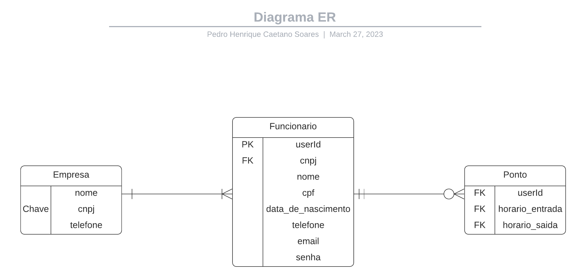

# Arquitetura da Solução

Pré-requisitos: <a href="3-Projeto de Interface.md"> Projeto de Interface</a>

Definição de como o software é estruturado em termos dos componentes que fazem parte da solução e do ambiente de hospedagem da aplicação.

## Diagrama de componentes

Diagrama que permite a modelagem física de um sistema, através da visão dos seus componentes e relacionamentos entre os mesmos.

Inclua um diagrama da solução e descreva os módulos e as tecnologias que fazem parte da solução. Discorra sobre o diagrama.

## Diagrama ER

## Diagrama BPMN

Temos aqui um diagrama sem a implementação do nosso aplicativo, podemos ver que existe uma demanda de outro empregado no caso o supervisor.

E aqui temos outro diagrama já com a implementação do aplicativo, podemos notar que não a a necessidade do supervisor gerir os horarios de ponto dos empregados, podendo focar seu trabalho em gestão da sua área

## Indicadores de Desempenho e Metas 

## Diagrama de Classes 

O diagrama de classes ilustra graficamente como será a estrutura do software, e como cada uma das classes da sua estrutura estarão interligadas. Essas classes servem de modelo para materializar os objetos que executarão na memória.

## Tecnologias Utilizadas

React-Native Expo CLI.

## Hospedagem

Explique como a hospedagem e o lançamento da plataforma foi feita.

> **Links Úteis**:
>
> - [Website com GitHub Pages](https://pages.github.com/)
> - [Programação colaborativa com Repl.it](https://repl.it/)
> - [Getting Started with Heroku](https://devcenter.heroku.com/start)
> - [Publicando Seu Site No Heroku](http://pythonclub.com.br/publicando-seu-hello-world-no-heroku.html)
