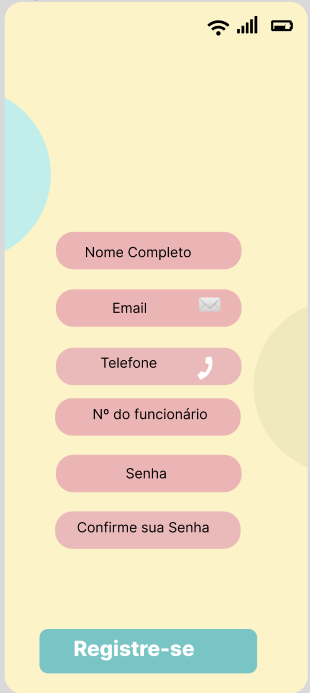
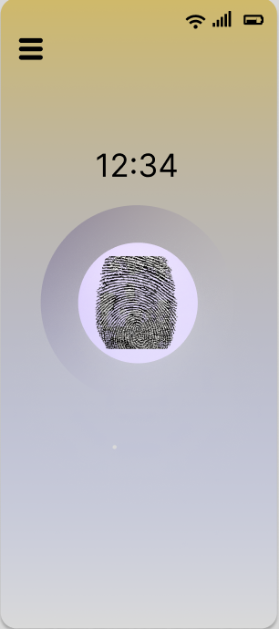
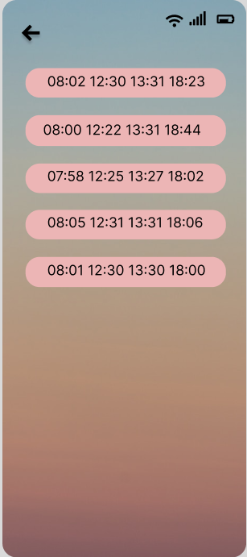

# Programação de Funcionalidades

## Cadastro

A Tela "Cadastro" possui um formulário contendo: Nome, e-mail, telefone, nº do Funcionário , senha e confirme sua senha para que seja realizado o cadastro do funcionário.

### Requisitos Atendidos:
<ul>
<li>RF-01 Efetuar cadastro  </li>
</ul>

### Teste de Funcionalidades:

Tela de cadastro em branco para ser preenchida pelo administrador:

Tela de cadastro preenchida incorretamente, portanto uma mensagem de erro aparece:

Tela de cadastro preenchida corretamente:

Página de informações do usuário cadastrado:

Processo de atualização dos dados cadastrados:

Dados de cadastro atualizados:

Deletar uma conta:

## Login

A Tela "Login" possui dois campos para que o funcionario utlize o Nº do funcionário e a senha para conseguir acessar o aplicativo.

 

### Requisitos Atendidos:
<ul>
<li>RF-02 Efetuar login  </li>
</ul>

### Teste de Funcionalidades:

## Marcação de Ponto

A Tela "Marcação de Ponto" possui um widget onde o usuário irá pressionar o horário será registrado no banco de dados. 

### Requisitos atendidos:
<ul>
<li>RF-03 - Registrar entrada/saída</li>
<li>RF-04 - Mostrar o horário registrado</li>
</ul>

## Página de Registros Realizados

A Tela "Registros Realizados" é uma página onde consta todos os registros feitos através do aplicativo.

### Requisitos atendidos:
<ul>
<li>RF-05 - Mostrar o tempo que se passou desde a entrada no sistema</li>
<li>RF-06 - Mostrar o tempo restante de trabalho e o horário previsto de saída</li>
<li>RF-07 - Histórico dos dias anteriores</li>
<li>RF-08 - Saldo do banco de horas</li>
</ul>
