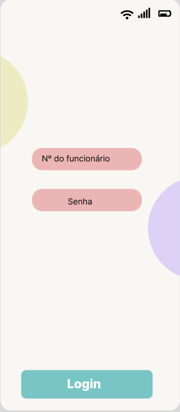

# Programação de Funcionalidades
A Tela "Cadastro" possui um formulário contendo: Nome, e-mail, telefone, nº do Funcionário , senha e confirme sua senha para que seja realizado o cadastro do funcionário.

Requisitos Atendidos:
<ul>
<li>RF-01 Efetuar cadastro  </li>
</ul>

A Tela "Login" possui dois campos para que o funcionario utlize o Nº do funcionário e a senha para conseguir acessar o aplicativo.

Requisitos Atendidos:
<ul>
<li>RF-02 Efetuar login  </li>
</ul>

